# Diagrama de Clases — Módulos Principales

> Módulos: **auth** · **backup** · **monitorizacion**  
> Formato: Mermaid ClassDiagram

```mermaid
classDiagram
    %% ================================================================
    %% SHARED — Machine (hub central de todos los módulos)
    %% ================================================================

    class Machine {
        <<db.Model>>
        +int id
        +String name
        +String ip
        +int port
        +String status
        +String description
        +DateTime last_seen
        +DateTime created_at
        +to_dict() dict
    }

    %% ================================================================
    %% MÓDULO: AUTH
    %% ================================================================

    class UserMixin {
        <<Flask-Login interface>>
        +is_authenticated bool
        +is_active bool
        +is_anonymous bool
        +get_id() str
    }

    class User {
        <<db.Model>>
        +int id
        +String username
        +String password_hash
        +String role
        +bool is_active
        +EncryptedString email
        +String email_hash
        +EncryptedString full_name
        +String language
        +String theme
        +String avatar_color
        +bool email_notifications
        +int failed_attempts
        +DateTime locked_until
        +DateTime last_login
        +DateTime created_at
        +set_password(password)
        +check_password(password) bool
        +to_dict() dict
    }

    class NotificationPreference {
        <<db.Model>>
        +int id
        +int user_id FK
        +bool machine_offline
        +bool service_down
        +bool backup_failed
        +bool backup_completed
        +bool daily_summary
        +DateTime updated_at
        +to_dict() dict
    }

    class RequireRole {
        <<decorator>>
        +tuple roles
        +__call__(fn) Callable
        -_check_auth() Response
    }

    class AuthRoutes {
        <<Blueprint /auth>>
        +login() Response
        +logout() Response
        +list_users() Response
        +create_user() Response
        +update_user(user_id) Response
        +delete_user(user_id) Response
        +get_profile() Response
        +update_profile() Response
        +change_password() Response
        +list_audit_logs() Response
        +export_audit_logs() Response
    }

    %% ================================================================
    %% MÓDULO: BACKUP
    %% ================================================================

    class BackupDestination {
        <<db.Model>>
        +int id
        +int machine_id FK
        +String name
        +String type
        +String path
        +String status
        +DateTime created_at
        +to_dict() dict
    }

    class BackupJob {
        <<db.Model>>
        +int id
        +int machine_id FK
        +int destination_id FK
        +String name
        +String source_path
        +String backup_type
        +String schedule
        +String schedule_time
        +bool compress
        +bool verify_after
        +bool notify
        +bool enabled
        +String scheduled_task_name
        +DateTime last_run_at
        +DateTime next_run_at
        +DateTime created_at
        +to_dict() dict
    }

    class BackupRun {
        <<db.Model>>
        +int id
        +int job_id FK
        +int machine_id FK
        +String status
        +float progress_pct
        +int files_done
        +BigInt bytes_done
        +BigInt total_bytes_estimate
        +float duration_sec
        +Text output
        +Text error
        +String backup_full_name
        +String backup_path
        +String job_name_snapshot
        +String backup_type_snapshot
        +DateTime started_at
        +DateTime finished_at
        +to_dict() dict
    }

    class ScheduleError {
        <<RuntimeError>>
        +message str
    }

    class BackupServices {
        <<module services.py>>
        +schedule_job_in_ps(job) str
        +unschedule_job_in_ps(job)
        +compute_next_run(schedule, hhmm) datetime
        +start_backup_run(job, ad_hoc) BackupRun
        +import_scheduled_runs(machine_id) int
        +prune_history(machine_id, keep) int
        -_execute_run(run_id, app)
    }

    class BackupParsers {
        <<module parsers.py>>
        +parse_backup_output(text) dict
        +parse_backup_list_output(text) list
        +parse_size_output(text) dict
        +parse_scheduled_tasks_output(text) list
        +parse_compression_output(text) dict
    }

    class BackupRoutes {
        <<Blueprint /api/backup>>
        +list_destinations() Response
        +create_destination() Response
        +update_destination(dest_id) Response
        +delete_destination(dest_id) Response
        +test_destination(dest_id) Response
        +list_jobs() Response
        +create_job() Response
        +update_job(job_id) Response
        +delete_job(job_id) Response
        +toggle_job(job_id) Response
        +run_job(job_id) Response
        +list_history() Response
        +restore_history(run_id) Response
        +delete_history(run_id) Response
        +verify_history(run_id) Response
        +get_summary() Response
        +compress_files() Response
        +decompress_files() Response
    }

    %% ================================================================
    %% MÓDULO: MONITORIZACION
    %% ================================================================

    class MonitoredService {
        <<db.Model>>
        +int id
        +int machine_id FK
        +String name
        +String icon_key
        +String ip
        +int port
        +String protocol
        +bool enabled
        +String last_status
        +float last_latency_ms
        +Text last_message
        +DateTime last_check
        +DateTime created_at
        +to_dict() dict
    }

    class ServiceCheck {
        <<db.Model>>
        +int id
        +int service_id FK
        +String status
        +float latency_ms
        +Text message
        +DateTime timestamp
        +to_dict() dict
    }

    class Probe {
        <<module probe.py>>
        +probe_service(ip, port, protocol, timeout) dict
        -_probe_tcp(ip, port, timeout) dict
        -_probe_udp(ip, port, timeout) dict
    }

    class Poller {
        <<module poller.py>>
        +POLL_INTERVAL_SEC int = 30
        +SOCKET_TIMEOUT float = 3.0
        +MAX_CHECKS_PER_SVC int = 200
        +check_service(service) tuple
        +run_poll_cycle(app)
        +start_poller(app, interval) Thread
        -_prune_checks(service_id, keep)
    }

    class MonitorizacionRoutes {
        <<Blueprint /api/monitorizacion>>
        +get_summary() Response
        +list_services() Response
        +create_service() Response
        +update_service(svc_id) Response
        +delete_service(svc_id) Response
        +check_service_now(svc_id) Response
        +list_activity() Response
        +add_machine() Response
        +update_machine(machine_id) Response
        +delete_machine(machine_id) Response
    }

    %% ================================================================
    %% NOTIFICACIONES (compartido backup + monitorizacion)
    %% ================================================================

    class EmailQueue {
        <<db.Model>>
        +int id
        +EncryptedString to_addr
        +String subject
        +EncryptedText body_html
        +EncryptedText body_text
        +String status
        +int tries
        +Text last_error
        +String related_kind
        +int related_id
        +DateTime scheduled_at
        +DateTime sent_at
        +DateTime created_at
        +to_dict() dict
    }

    %% ================================================================
    %% RELACIONES — AUTH
    %% ================================================================

    UserMixin <|-- User : implements
    User "1" --o "1" NotificationPreference : tiene ▶
    AuthRoutes ..> User : gestiona
    AuthRoutes ..> RequireRole : aplica
    RequireRole ..> User : verifica rol de

    %% ================================================================
    %% RELACIONES — BACKUP
    %% ================================================================

    Machine "1" --* "N" BackupJob       : aloja
    Machine "1" --* "N" BackupRun       : registra
    Machine "1" --o "N" BackupDestination : almacena en

    BackupDestination "1" --o "N" BackupJob   : destino de ▶
    BackupJob         "1" --* "N" BackupRun   : genera ▶

    BackupRoutes  ..> BackupServices : delega en
    BackupRoutes  ..> BackupParsers  : usa
    BackupRoutes  ..> RequireRole    : aplica
    BackupServices ..> BackupJob     : orquesta
    BackupServices ..> BackupRun     : crea / actualiza
    BackupServices ..> EmailQueue    : encola alertas →
    BackupServices ..> ScheduleError : lanza

    %% ================================================================
    %% RELACIONES — MONITORIZACION
    %% ================================================================

    Machine         "1" --o "N" MonitoredService : supervisa
    MonitoredService "1" --* "N" ServiceCheck    : registra ▶

    MonitorizacionRoutes ..> MonitoredService : gestiona
    MonitorizacionRoutes ..> RequireRole      : aplica
    Poller ..> MonitoredService : sondea
    Poller ..> ServiceCheck     : crea
    Poller ..> Probe             : usa
    Poller ..> EmailQueue        : encola alertas →
```

---

## Leyenda de relaciones

| Notación | Significado |
|----------|-------------|
| `<\|--` | Herencia / implementa interfaz |
| `*--` | Composición (el hijo no existe sin el padre) |
| `o--` | Agregación (asociación débil) |
| `..>` | Dependencia / uso en tiempo de ejecución |
| `FK` | Clave foránea en base de datos |

## Roles de acceso por módulo

| Operación | superadmin | admin | operador | solo_lectura |
|-----------|:---:|:---:|:---:|:---:|
| CRUD usuarios | ✓ | parcial | — | — |
| Exportar auditoría | ✓ | ✓ | — | — |
| Crear/editar backup job | ✓ | ✓ | — | — |
| Ejecutar backup | ✓ | ✓ | ✓ | — |
| Crear servicio monitorizado | ✓ | ✓ | — | — |
| Comprobar servicio ahora | ✓ | ✓ | ✓ | — |
| Ver datos (lectura) | ✓ | ✓ | ✓ | ✓ |
